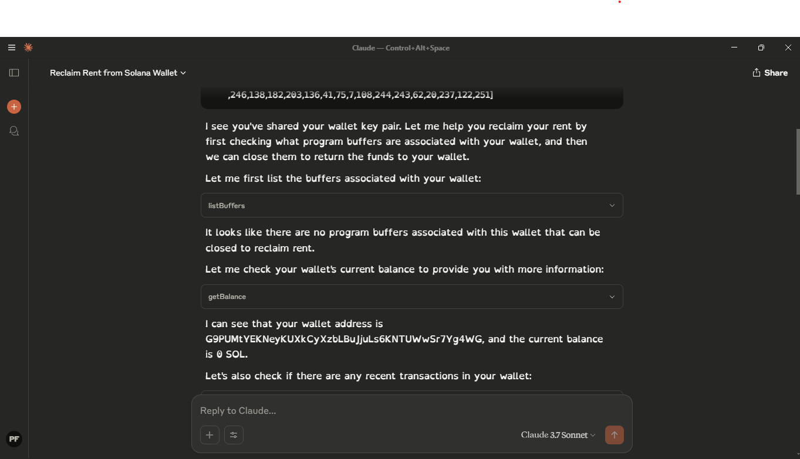

# WalletMCP - Solana Blockchain MCP Server

WalletMCP is a Model Context Protocol (MCP) server implementation for interacting with the Solana blockchain. 
It exposes developer-friendly tools for working with wallets, transactions, program buffers, logs, and SOL transfers through MCP-compatible interfaces.

## 📺 Demo Video

[](https://www.youtube.com/watch?v=rq2KudYZCrQ)
*Click the image above to watch the demo video*

## 🧠 Features

- 🔍 Retrieve wallet transactions and SOL balances.
- 📜 Access program logs from the Solana blockchain.
- 🧾 Claims Unused Rents (List and close BPF Upgradeable Loader buffers).
- 💸 Send SOL transactions programmatically.
- 🧩 Fully MCP-compliant tool definitions using Zod for schema validation.


## 🔧 Technologies Used

- **Solana Web3.js SDK** – Solana blockchain interaction
- **Model Context Protocol (MCP)** – Protocol for tool registration
- **Zod** – Input validation
- **TypeScript** – Strong typing and modern tooling


## 📋 Requirements

- Node.js v16+
- Yarn or npm


## 🚀 Getting Started
1. Clone the repository
   ```bash
   git clone https://github.com/paulfruitful/WalletMCP
 ```

   ```bash
   cd walletMCP
   ```
2. **Install dependencies**
   ```bash
   npm install
   ```

3. **Build the MCP Server**
   ```bash
   npm run build
   ```
## Test The Server:
To test the server you can use Claude Desktop MCP Client. Click here to download the desktop application:
[Download Claude Desktop](https://claude.ai/download)

### For Claude Desktop
Run the following command this command to open the Claude Desktop Config File

**On Windows**:
```bash
   code $env:AppData\Claude\claude_desktop_config.json

```
**On Mac/Linux**:
```bash
   code ~/Library/Application\ Support/Claude/claude_desktop_config.json
```
After opening the config file, add the server:

```json
{
  "mcpServers": {
    "walletmcp": {
      "command": "node",
      "args": [
          "YOUR_PATH_PREFIX\\WalletMCP\\build\\index.js"
      ]
  }
  }
}
```

It's all set! 
You can now use the tools provided by the server in Claude Desktop.
You can activate these tools on the Claude client by asking questions relating to the Solana wallet.



Questions & Prompts like:
- "What are my recent transactions?"

- "How much SOL do I have?"


- "How many buffers do I have unused?"
- "Can You send SOL to account [accountAddress]?"
- "What are the logs for a specific program [programId]?"


## ⚙️ Tools & Their Descriptions

### `getTransactions`
**Description**: Retrieve recent transactions of a wallet.  
**Inputs**:
- `walletAddress` (string)
- `limit` (number) - maximum number of transactions to fetch.

### `getBalance`
**Description**: Fetch the SOL balance of a wallet.  
**Inputs**:
- `walletAddress` (string)

### `listBuffers`
**Description**: List program buffers associated with a payer key.  
**Inputs**:
- `payerKey` (array of numbers)

### `closeBuffer`
**Description**: Close a buffer and return lamports to the payer.  
**Inputs**:
- `bufferPubkey` (string)
- `payerKey` (array of numbers)

### `getProgramLogs`
**Description**: Fetch transaction logs from a specific program ID.  
**Inputs**:
- `programId` (string)
- `limit` (number) - optional, default is 10

### `sendSolTransaction`
**Description**: Send SOL from one wallet to another.  
**Inputs**:
- `fromPrivateKey` (array of numbers)
- `toPublicKeyStr` (string)
- `amountSol` (number)
- `mode` ("main" | "dev")


## 🛡️ Security Considerations

- Always protect your private keys.
- Keys are not stored or logged in the server


## 🤝 Contributing

This project is open to contributions from the Solana dev community.
If you have ideas for improvements, feel free to open an issue or submit a pull request.